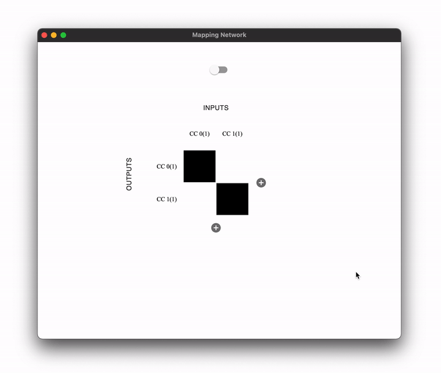

# Mapping Network

This project was developed as part of my Bachelor's degree project at the Ionian University in Corfu, Greece. Development started in 2018.

*Mapping Network* is an application for making complex MIDI controller-to-software mappings. Aiming to mimic the overlapping one-to-many and many-to-one gesture-to-sound mappings found on acoustical musical instruments. The interface is designed after the pin matrix popularized by hardware synths, with the addition of specifying percentages (or weights) to each mapping, rather than choosing just whether two parameters are mapped or not. *Mapping Network* has also built in a rate-of-change calculation feature for control parameters, enabling the use of motion as an excitation gesture for sound.
